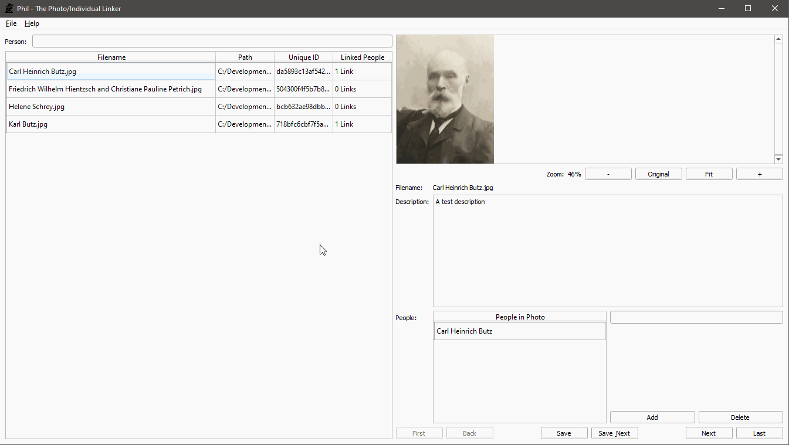

# Phil - Photo/Individuals Linker (for genealogy)

Phil allows you to add metadata to your ancestral photos like when it was taken, where and who is in the photo. The data is stored alongside the photo in a YAML file, which is simple to read with any text editor. There is no lock-in and the data is easy to move around along with the photo.

To try it out, download the [latest release](https://github.com/pkuehne/grant/releases/latest).

## Features

- All data stored in YAML - easy to read and named after the photo file so they are always together
- Load all photos in a folder even in a nested folder structure
- Pan and zoom photo
- Save a note/description about the photo (to give more detail about the photo)
- Tag each photo with the people in them
- Filter the list of photos by the people tagged

## Coming Soon

- Link names to faces - select a portion of the photo to link to a name
- More metadata (date photo was taken, location, etc)
- Remember last folder opened
